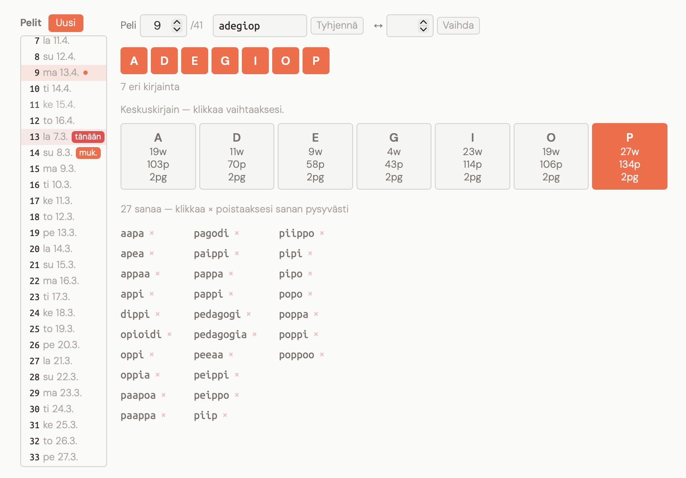

# Admin Tools: Sanakenno & Kenno Tool

Guide for managing the **Sanakenno** (Finnish Spelling Bee) game via the admin dashboard — puzzle rotation, word list moderation, and player analytics.

---

## Kenno Tool (Kennotyökalu)

The Kenno Tool is the primary interface for managing the puzzle lifecycle. It allows you to preview upcoming puzzles, override center letters, block inappropriate words, and swap or delete puzzle slots.

### Screenshot

Kenno Tool in light mode, showing puzzle #9 (`adegiop`) with center letter **P** selected.

### Key Features

1. **Puzzle List (Left Sidebar):**
    * Scrollable list of all puzzle slots with upcoming play dates.
    * `tänään` (red badge) marks today's live puzzle, which is protected from editing.
    * `muk.` (mukautettu) badge marks puzzles that have been manually overridden from their defaults.
    * The currently selected slot is highlighted with a contrasting background.
2. **Toolbar:**
    * Slot number, letters input field, and "Tyhjennä" (clear/revert) button.
    * Swap controls (`↔`) to exchange two puzzle slots.
    * "Uusi" button to create a new puzzle slot beyond the base rotation.
3. **Variations Grid:** Shows stats (word count, max score, pangram count) for all 7 possible center letters. The active center is highlighted in orange. Clicking a different letter switches the center.
4. **Word List:** All valid words for the current center, displayed in columns. Clicking the red `×` next to a word triggers a permanent block across *all* puzzles (with confirmation dialog).
5. **Preview Mode (Dirty State):** When editing the letters field, the tool enters preview mode. Pressing Enter calculates all 7 variations on-the-fly via `/api/kenno/preview`. Select a center letter, then save to commit the custom puzzle to the slot.

---

## Sanakenno Stats (Kenno Stats)

Separate admin tab providing a high-level overview of game engagement and player achievements.

* **Achievement Tracking:** Records anonymous rank transitions (session-deduplicated). Shows daily counts grouped by all 7 rank levels.
* **Retention Signal:** The "Ällistyttävä" (70%) and "Täysi kenno" (100%) columns indicate puzzle difficulty and player persistence.
* **Period Selector:** Toggle between 7, 30, and 90 days to track trends.
* **Totals Row:** Aggregated counts across the selected period.

---

## Security & Data Integrity

* **Admin Required:** All mutation endpoints (`/center`, `/block`, `/puzzle`, `/swap`, `/delete`) are protected by the `@admin_required` decorator.
* **Live Slot Protection:** Today's active puzzle slot cannot be edited, swapped, or deleted (returns 409).
* **Confirmation Dialogs:** Destructive actions (blocking words, swapping slots, deleting/reverting puzzles) require `window.confirm()` before proceeding.
* **Cache Invalidation:** `_PUZZLE_CACHE` is automatically cleared whenever a center is changed or a word is blocked, ensuring players always see up-to-date data.
