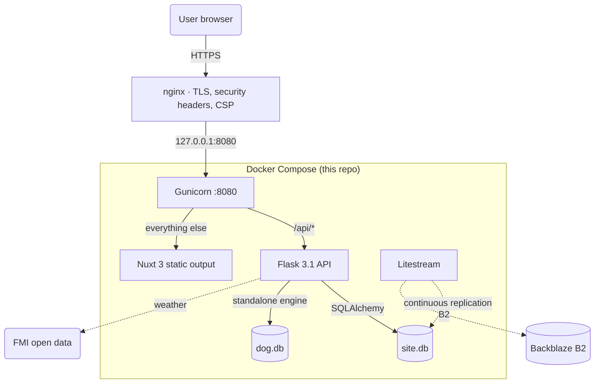
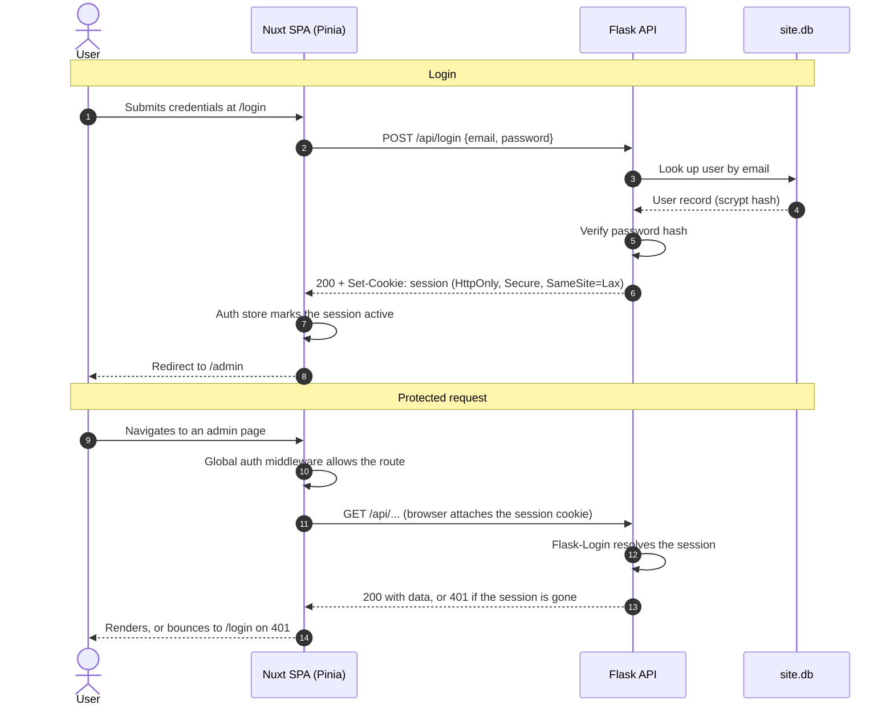

# erez.ac architecture

How this application is put together. **Host-level architecture — nginx, TLS,
the firewall, the deploy webhook, and how erez.ac and sanakenno.fi share the
machine — lives in `~/Projects/nuc/README.md`** and is not repeated here.

## Request lifecycle

Two databases, deliberately separate: `site.db` holds the site's own content
and users; `dog.db` is the dog-show browser's permanent store, has its own
SQLAlchemy engine, and is **not** covered by Litestream — it is backed up by
hand. See [dog-show-browser.md](dog-show-browser.md).

## Authentication

Session cookies via Flask-Login, with scrypt password hashing. There is no
self-registration — accounts are created with `app/create_user.py`.

The cookie is the only credential: there is no token in JavaScript-reachable
storage. Mutation endpoints accept JSON only, which is what stands in for CSRF
tokens here — a cross-origin form post cannot set `Content-Type:
application/json` without a preflight.

Rate limiting is per-client-IP via Flask-Limiter, which is why `ProxyFix` must
resolve the real client address; see the CLAUDE.md security notes.
